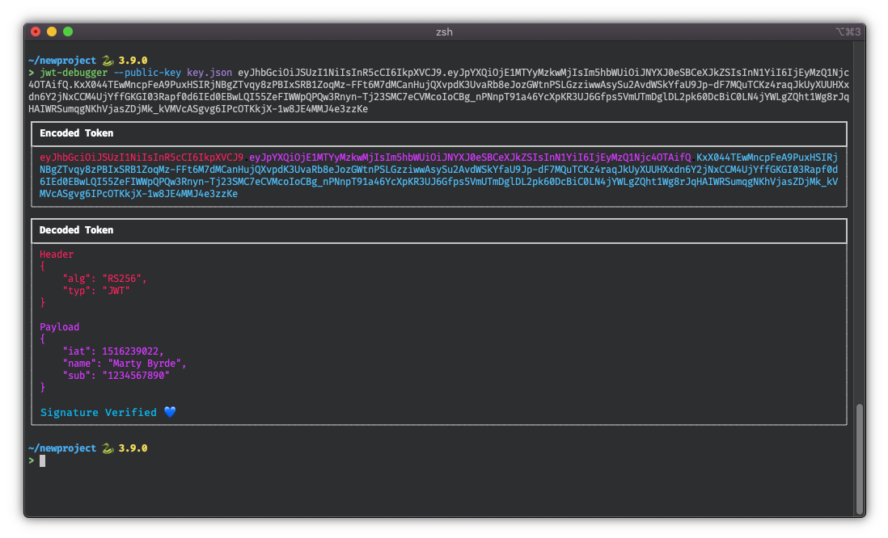

# JWT Debugger

[](https://github.com/khwiri/jwt-debugger)
[](https://github.com/khwiri/jwt-debugger/actions/workflows/test.yml)
[](https://github.com/khwiri/jwt-debugger/actions/workflows/lint.yml)
[](https://github.com/khwiri/jwt-debugger)

**JWT Debugger** is a command-line interface inspired by [jwt.io](https://jwt.io)
that can be used for decoding and verifying JSON Web Tokens. Under the hood,
[JWCrypto](https://jwcrypto.readthedocs.io/en/latest/) is doing the heavy lifting
so that the token can be locally introspected.



## Installing

Install with [pip](https://pip.pypa.io/en/stable).

*Note: Passing --editable so that pip freeze produces usable requirements.*

```
pip install --editable git+https://github.com/khwiri/jwt-debugger.git@main#egg=jwt-debugger
```

Install with [pipenv](https://pipenv.pypa.io/en/latest).

```
pipenv install git+https://github.com/khwiri/jwt-debugger.git@main#egg=jwt-debugger
```

## Usage

```
jwt-debugger --help
Usage: jwt-debugger [OPTIONS] TOKEN

Options:
  --public-key FILENAME     JSON Web Key in JSON or PEM format for signature
                            verification.

  --oidc-provider-url TEXT  OpenID Connect Provider URL where JSON Web Key Set
                            can be pulled for signature verification.

  --help                    Show this message and exit.
```

### Examples

Simply pass a JSON Web Token to have it decoded.

```
jwt-debugger TOKEN
```

If you have a JSON Web Key then that can be used to verify whether the token has
been tampered with by verifying that the signature matches. JSON Web Keys can be
in standard JSON format or PEM files.

```
jwt-debugger --public-key jwk.json TOKEN
```

```
jwt-debugger --public-key jwk.pem TOKEN
```

Alternatively, JSON Web Keys can be used from OpenID Connect Providers. This can
be accomplished by using the `--oidc-provider-url` argument and a url referencing
[OpenID Connect Provider Configuration Information](https://openid.net/specs/openid-connect-discovery-1_0.html#ProviderConfig).

```
jwt-debugger --oidc-provider-url https://accounts.google.com/.well-known/openid-configuration TOKEN
```

If you're using [IdentityServer4](https://github.com/IdentityServer/IdentityServer4)
then a direct url to the JSON Web Key Set can be used.

```
jwt-debugger --oidc-provider-url https://demo.identityserver.io/.well-known/openid-configuration/jwks TOKEN
```

## Contributing

For guidance on setting up a development environment and how to make a contribution,
see the [contributing guidelines](./CONTRIBUTING.md).
